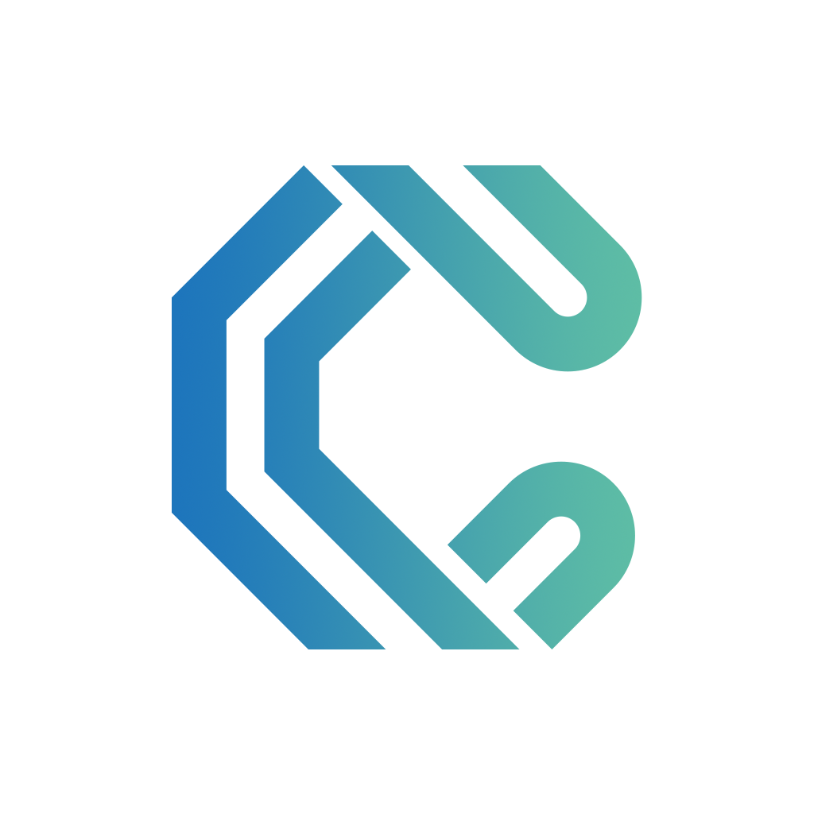

# 简介

<figure><figcaption></figcaption></figure>

CNS(Coin  Name Service)WEB3 身份ID服务是一种基于开源区块链的命名协议。是WEB3重要的基础设施构建者.​

.coin于 2021 年初在创立，创始团队来自世界顶级投行及以太坊早期成员，2022 年独立运营。.coin由英国克隆实验室和英国基金COINAME 管理，是属于第三代互联网基础设施的一部分.​

Coiname基金 运营包括 CNS \C-MAIL\C-zone 在内的生态产品，三者相互依托，为共建WEB3生态及品牌提供了核心竞争力.​

.coin是基于币安链的开源协议,.coin为DAPP使用者提供了一个项目数据源。但又提供了跨链域名的基础设施，用户可以在多链间切换.COIN域名NFT.​

.COIN 提供了以 .coin 为后缀的WEB3唯一的命名，可用于加密资产转账，域名解析，身份认证、匿名邮箱、NFT交易等场景。作为去中心化账户身份系统，用户可以通过一个CNS，用户拥有 .coin账户的完整控制权和使用权.​

C-mail

C-mail邮箱（Chian mail），又称WEB3邮箱 是WEB3生态的重要组成部分， Cmail基于区块链的开源协议及传统DNS的组合，为使用者提供了一个安全、匿名、数据自己持有、方便的新型邮箱。.

C- space​

Cspace​全名（Chian space​）链上web3空间，协议建立在完全开源的区块链上，它赋予了web3新的革命，在空间中，所有的数据和内容完全由用户自己管理​。数据协同至IPFS网络.在个人空间中WEB3域名将是空间唯一的标识，这是在区块链的一次革新，将web3生态再次赋予新的生命，Cspace它定义了web3的全新社交方式，对于未来的web3社交将起到深远的影响。

