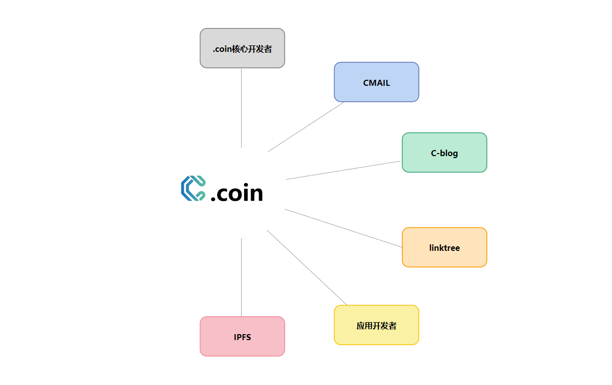

# 共建生态

.coin是致力于成为web3的基础设施，这离不开全球生态的共同建设。这样可以让 .coin更加壮大。.coin是一个开源项目，核心是部署在区块链上的智能合约，任何人都可以无需许可的参与建设 .coin。​

<figure><figcaption></figcaption></figure>

核心开发者接入我们的CNS将是对WEB3发展的支持，CNS对所有web3的生态建设者给与最大的支持

我们提供了详细的SKD文档和 API文档 开发者详情 请参考 API 文档也可通过<mark style="color:blue;">code@cns.im</mark> 请求帮助

