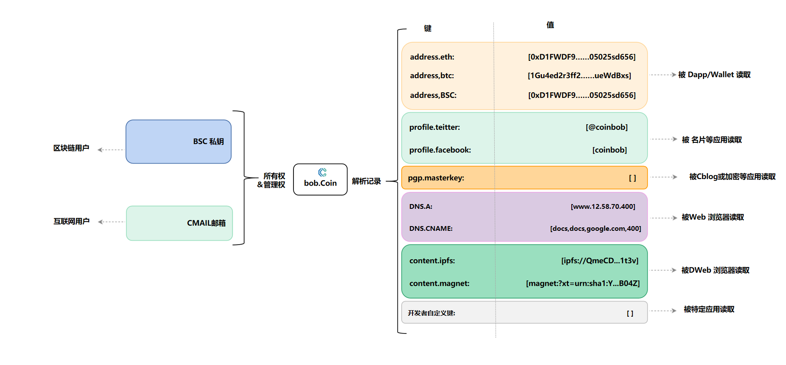

# 架构

我们基于WEB3 身份ID服务开发了CNS(Coin  Name Service)协议架构。CNS是WEB3重要的基础设施构建者.​

<figure><figcaption></figcaption></figure>

Resolution Service​

根据 BSC 上的交易解析出 .coin的全局状态，并以接口的形式对外提供账户解析服务。​

Client SDK​

包含各种语言的 SDK，用于简化移动端钱包，网页版钱包，服务端钱包以及其他 .coin相关应用的集成工作。​

​Dapp UI

用户最终通过各种应用界面使用 .coin的各项功能。这些应用可以直接在浏览器中使用，也可以集成到主流的钱包软件中。​

以上所有组件的源代码，都可以在我们的 Github 仓库中找到。同时，开发者可以根据 Core Protocol 实现 Client SDK，Dapp UI。​
